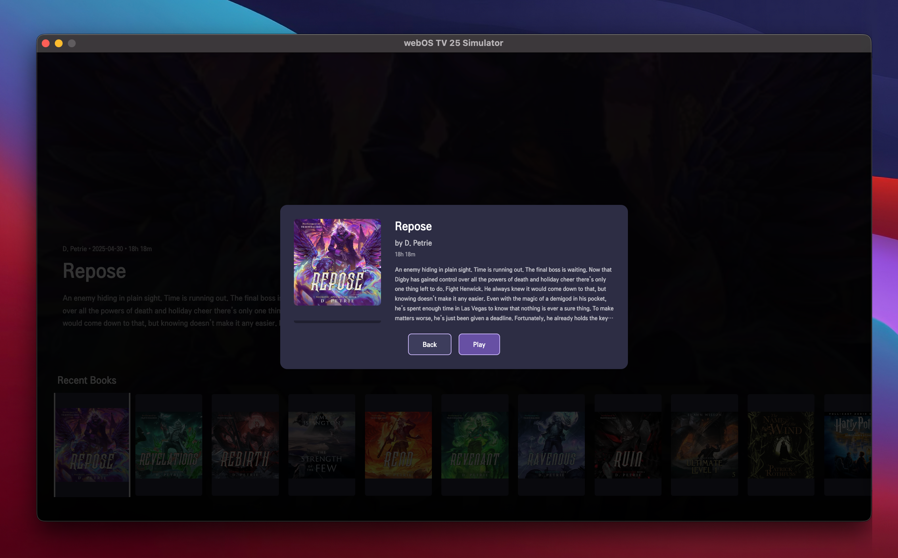
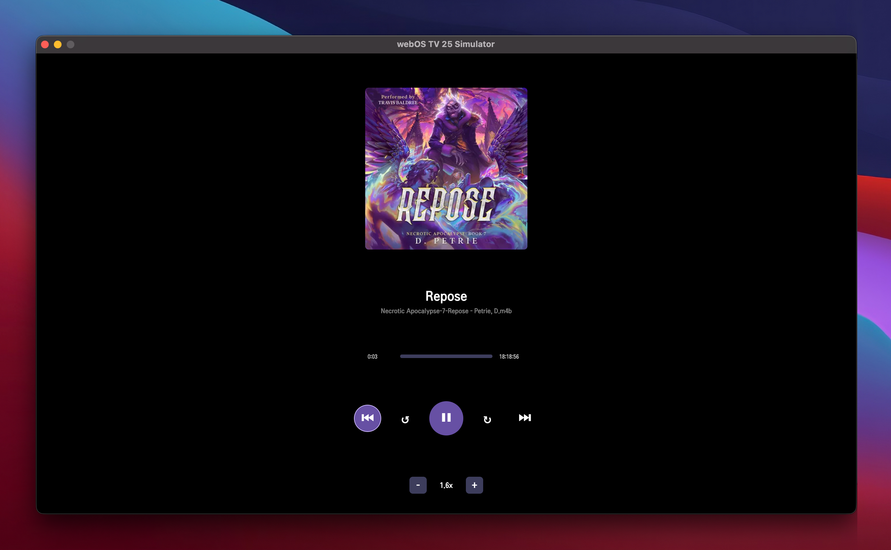
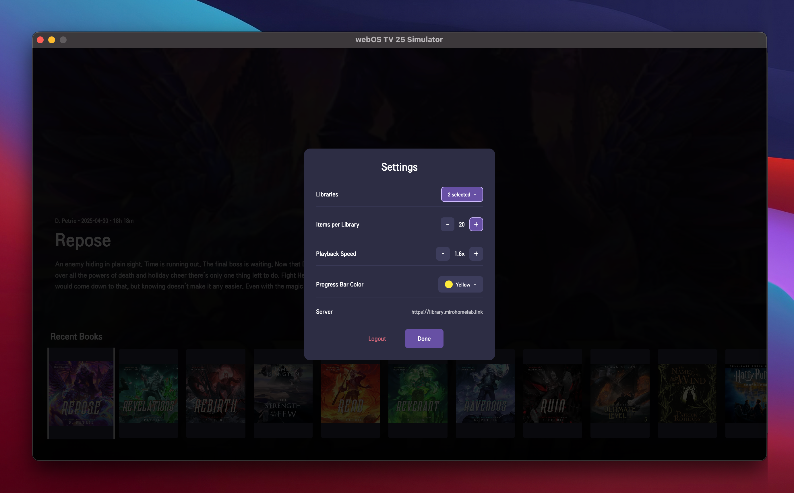

# SwiftShelf for webOS

<p align="center">
  
</p>

SwiftShelf is a webOS Audiobookshelf client for LG smart TVs. It provides fast, focused navigation of your Audiobookshelf libraries with fully integrated playback, chapter navigation, and progress syncing, presenting your collection in a sleek carousel interface that stays remote-friendly.

## Key Features

### Connection & Authentication
- **Flexible Authentication**
  Log in with either username/password or API key. Credentials are stored locally so reconnecting after app relaunches is seamless.

- **Library Selection & Persistence**
  Choose from your available Audiobookshelf libraries. The app remembers your selections and loads them automatically on launch.

### Library Browsing
- **Recent & Continue Listening Carousels**
  Browse your most recently added audiobooks and quickly jump back into in-progress titles. Each carousel shows cover artwork, author, and duration with playback progress overlays.
  

- **Sidebar Navigation**
  Access your libraries, search, and settings from the slide-out sidebar menu.
  

- **Search**
  Query your Audiobookshelf library to find books, authors, and series quickly.

### Item Details & Playback
- **Item Detail View**
  Selecting a title opens a detailed view with cover artwork, author, narrator, description, and progress information.
  

- **Full-Screen Player**
  A dedicated player view with:
  - Large cover artwork and metadata
  - Progress bar with current time and duration
  - Transport controls: previous chapter, skip back 30s, play/pause, skip forward 30s, next chapter
  - Playback speed adjustment (0.5x - 3.0x)
  - Chapter display

  

### Progress & Sync
- **Server Progress Tracking**
  Playback progress syncs with your Audiobookshelf server. Resume where you left off across all your devices (web, mobile, TV).

- **Session Management**
  Listening sessions are tracked and reported to the server, including total time listened and playback position.

### Customization
- **Customizable Experience**
  Tune how many items each library fetches, pick the progress bar color, and set a preferred default playback speed. All settings persist across sessions.

  

- **Optimized for TV Navigation**
  All carousels, lists, and player controls are remote-friendly with visual focus indicators for a smooth TV experience.

## Example Flow

1. **Login**: Supply host and credentials on the login screen.
2. **Library Selection**: Choose which library(ies) you want to browse.
3. **Browse**: Explore recent and in-progress items, or use search to find what you need.
4. **View Details**: Select a title to see its full details and description.
5. **Play**: Start playback from the detail view. Use the player controls to navigate chapters and adjust speed.
6. **Resume Anywhere**: Your progress syncs automatically - pick up where you left off on any device.

## Requirements

- LG webOS TV (webOS 3.0+)
- Audiobookshelf server with API access

## Installation

### Install via Homebrew Channel

Coming soon.

### Manual Installation (Sideloading)

1. Enable Developer Mode on your LG TV
2. Install the [webOS TV SDK](https://webostv.developer.lge.com/develop/tools/sdk-introduction)
3. Connect to your TV using `ares-setup-device`
4. Install the IPK:
   ```bash
   ares-install com.swiftshelf.webos_1.0.0_all.ipk
   ```

## Configuration

- **Host**: Your Audiobookshelf base URL (e.g., `https://library.example.net`)
- **Username/Password** or **API Key**: Your Audiobookshelf credentials
- Optional: Add a `.swiftshelf-config.json` with `host`, `apiKey`, `username`, and `password` to auto-populate the login form during development. An example file lives at `.swiftshelf-config.example.json`.

## Development

### Setup

1. Clone the repository:
   ```bash
   git clone https://github.com/michaeldvinci/swiftshelf-webos.git
   cd swiftshelf-webos
   ```

2. Copy the example config (for local testing):
   ```bash
   cp .swiftshelf-config.example.json .swiftshelf-config.json
   ```

3. Edit `.swiftshelf-config.json` with your server details.

### Building

Package the app:
```bash
ares-package .
```

### Running on TV

1. Set up your device:
   ```bash
   ares-setup-device
   ```

2. Install and launch:
   ```bash
   ares-install com.swiftshelf.webos_1.0.0_all.ipk
   ares-launch com.swiftshelf.webos
   ```

### Running in Browser (Development)

For quick testing, you can run a local server:
```bash
ares-server .
```
Then open `http://localhost:3000` in your browser.

## Remote Control

| Button | Action |
|--------|--------|
| **Arrow Keys** | Navigate |
| **OK/Enter** | Select |
| **Back** | Go back / Close modal |
| **Play/Pause** | Toggle playback |

### Player Controls

| Button | Action |
|--------|--------|
| **Left/Right** | Seek -/+ 30 seconds |
| **Up/Down** | Previous/Next chapter |
